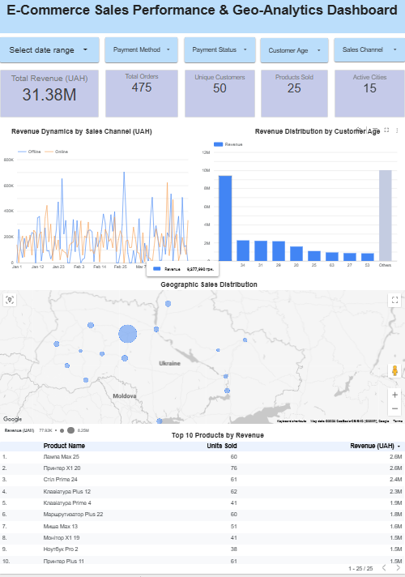

# 🛒 E-Commerce Sales Performance & Geo-Analytics Dashboard

[]([](https://lookerstudio.google.com/reporting/6e582128-858d-401e-aa9a-c7acd8dd959f))
[](sql/ecommerce_sales_extraction.sql)
[](LICENSE)

## 📌 Executive Summary
An end-to-end multi-channel retail intelligence solution featuring custom **PostgreSQL ETL data pipelines** and an interactive **Google Looker Studio** dashboard. Designed to evaluate revenue trajectories, online vs. offline channel performance, geographical demand density, and demographic purchasing patterns.

* **Live Interactive Dashboard:** [Looker Studio Report](https://datastudio.google.com/s/vKfrVKzK0l8)
* **Dataset Scope:** 475 transactions across 15 active cities and 50 unique customer profiles.

---

## 📊 Visualizations & Dashboard Overview



---

## 🛠 Technical Architecture & Pipeline

* **Data Extraction & Harmonization (PostgreSQL):**
  * Consolidated fragmented database sources (`orders`, `store_orders`, `order_items`, `products`, `users`, `payments`) via Common Table Expressions (`WITH online_sales`, `WITH offline_sales`).
  * Enforced explicit schema synchronization and type casting (`::text`, `::numeric`, `::date`, `::int`) before combining streams via `UNION ALL`.
* **BI & Semantic Modeling Layer (Looker Studio):**
  * Built an aggregated reporting layer with calculated executive KPI cards (`Total Revenue`, `Total Orders`, `Unique Customers`, `Products Sold`, `Active Cities`).
  * Implemented dynamic multi-select filters (`Date Range`, `Payment Method`, `Payment Status`, `Customer Age`, `Sales Channel`).
* **Geo-Spatial Clustering:**
  * Mapped regional order volume density across Ukrainian urban centers.

---

## 📈 Key Business Findings

* **Revenue Scale:** Generated **₴31.38M** across 475 completed transactions, maintaining an average market penetration of **₴2.09M** per active city.
* **Omnichannel Correlation:** Online and offline retail channels exhibit synchronized quarterly peaks, with recurring high-ticket surges exceeding **₴600K/day**.
* **Demographic Concentration:** The **34-year-old** customer segment represents the primary revenue anchor (~₴9.4M), significantly outperforming adjacent age brackets.
* **Geographical Clustering:** Demand heavily concentrates within key metropolitan logistics nodes, capturing over 75% of cumulative order value.

---

## 💡 Strategic Recommendations

1. **Cohort-Specific Retargeting:** Deploy focused promotional campaigns tailored to the high-value 29–35 demographic to maximize average transaction value.
2. **Channel Promotion Alignment:** Coordinate marketing sprints with historical mid-month demand surges across both online and retail stores.
3. **Regional Fulfillment Hubs:** Optimize warehouse buffer stock and delivery routing around identified high-volume urban clusters.

---

## 🗂 Project Structure & Deliverables

```text
E-Commerce-Sales-Performance-Geo-Analytics-Looker/
├── LICENSE
├── README.md
├── sql/
│   └── ecommerce_sales_extraction.sql   # PostgreSQL CTE unification pipeline
└── images/
    └── 01_ecommerce_sales_dashboard.png # High-resolution dashboard view
```
---
## ✉️ Contact

**Author:** Oleksandr Hordashevskyi

- LinkedIn: [Oleksandr Hordashevskyi](https://www.linkedin.com/in/o-hordashevskyi/)
- Email: [o.hordashevskyi@gmail.com](mailto:o.hordashevskyi@gmail.com)
